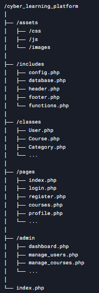
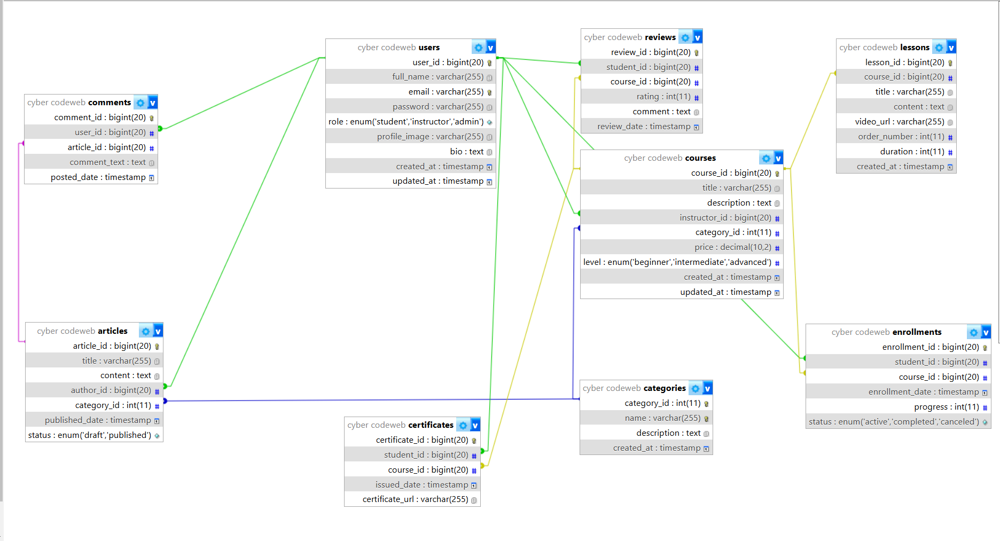

# تصميم قاعدة بيانات منصة تعليمية للأمن السيبراني والبرمجة
في هذا الملف نقدم تخطيط وتصميم قاعدة بيانات متكاملة لمنصة تعليمية تشمل الكورسات، الطلاب، المقالات وغيرها من العناصر التي تلبي متطلبات منصة تعليمية كبيرة CYBER CODE. يتميز التصميم بدعم العلاقات بين الجداول المختلفة وتحقيق الأمان وسهولة التوسع.

---

## 1. الجداول الرئيسية وعلاقاتها

### 1.1 جدول المستخدمين (Users)
يضم جميع المستخدمين سواء كانوا طلاباً أو مدرسين أو إداريين.
- **user_id**: معرف المستخدم (Primary Key).
- **full_name**: اسم المستخدم بالكامل.
- **email**: البريد الإلكتروني (يفضل أن يكون فريدًا).
- **password**: كلمة المرور (يُخزن بشكل مشفر).
- **role**: دور المستخدم (مثل: `student`، `instructor`، `admin`).
- **created_at**: تاريخ ووقت إنشاء الحساب.
- **updated_at**: تاريخ وآخر تحديث.

### 1.2 جدول الفئات (Categories)
يستخدم لتصنيف الدورات والمقالات (يمكن تقسيمه إلى جدولين منفصلين حسب الحاجة).
- **category_id**: معرف الفئة (Primary Key).
- **name**: اسم الفئة.
- **description**: وصف مختصر للفئة.

### 1.3 جدول الدورات (Courses)
يحوي بيانات الكورسات المقدمة من المدرسين.
- **course_id**: معرف الدورة (Primary Key).
- **title**: عنوان الدورة.
- **description**: وصف الدورة.
- **instructor_id**: معرف المدرس (Foreign Key يشير إلى `Users.user_id` حيث role = `instructor`).
- **category_id**: معرف الفئة (Foreign Key يشير إلى `Categories.category_id` لفئات الدورات).
- **created_at** و **updated_at**: توقيتات الإنشاء والتحديث.

### 1.4 جدول التسجيل في الدورات (Enrollments)
يمثل العلاقة بين الطلاب والدورات (علاقة many-to-many بين المستخدمين (طلاب) والدورات).
- **enrollment_id**: معرف التسجيل (Primary Key).
- **student_id**: معرف الطالب (Foreign Key يشير إلى `Users.user_id` حيث role = `student`).
- **course_id**: معرف الدورة (Foreign Key يشير إلى `Courses.course_id`).
- **enrollment_date**: تاريخ التسجيل.
- **progress**: نسبة التقدم (مثلاً: من 0% إلى 100%).
- **status**: حالة التسجيل (نشط، منتهي، ملغي...).

### 1.5 جدول الدروس (Lessons)
يحتوي على محتوى الدروس أو الوحدات التعليمية داخل كل دورة.
- **lesson_id**: معرف الدرس (Primary Key).
- **course_id**: معرف الدورة (Foreign Key يشير إلى `Courses.course_id`).
- **title**: عنوان الدرس.
- **content**: محتوى الدرس (قد يكون نصاً، فيديو، إلخ).
- **order_number**: رقم الترتيب ضمن الدورة.
- **duration**: مدة الدرس (مثلاً: بالدقائق).
- **created_at** و **updated_at**: توقيتات الإنشاء والتحديث.

### 1.6 جدول المقالات (Articles)
يشمل الأخبار والمقالات المتعلقة بالأمن السيبراني والبرمجة.
- **article_id**: معرف المقال (Primary Key).
- **title**: عنوان المقال.
- **content**: محتوى المقال.
- **author_id**: معرف الكاتب (Foreign Key يشير إلى `Users.user_id`، حيث يكون الكاتب عادةً مدرس أو إداري).
- **category_id**: معرف الفئة (Foreign Key يشير إلى `Categories.category_id` لفئات المقالات، أو يمكن استخدام جدول فئات منفصل).
- **published_date**: تاريخ النشر.
- **status**: حالة المقال (منشور، مسودة، ...).

### 1.7 جدول التعليقات (Comments) 
يمكن استخدامه لتمكين التعليقات على المقالات (أو الدروس).
- **comment_id**: معرف التعليق (Primary Key).
- **user_id**: معرف المستخدم (Foreign Key يشير إلى `Users.user_id`).
- **article_id**: معرف المقال (Foreign Key يشير إلى `Articles.article_id`).
- **comment_text**: نص التعليق.
- **posted_date**: تاريخ ووقت النشر.

---

## 2. العلاقات بين الجداول (ER Diagram مبسط)

  
   
  <em>تنظيم الملفات</em>

  
   
  <em>الجداول والعلاقات</em>

- **العلاقة بين Users و Courses:**  
  يمكن للمدرس (instructor) إنشاء عدة دورات (علاقة واحد إلى متعدد).

- **العلاقة بين Users و Enrollments:**  
  يمكن للطالب (student) التسجيل في عدة دورات (علاقة واحد إلى متعدد).

- **العلاقة بين Courses و Enrollments:**  
  يمكن لكل دورة أن يكون لها عدة طلاب مسجلين (علاقة واحد إلى متعدد).

- **العلاقة بين Courses و Lessons:**  
  تحتوي كل دورة على عدة دروس (علاقة واحد إلى متعدد).

- **العلاقة بين Users و Reviews:**  
  يمكن للطالب (student) ترك مراجعات للدورات (علاقة واحد إلى متعدد).

- **العلاقة بين Courses و Reviews:**  
  يمكن لكل دورة أن تحتوي على عدة مراجعات من الطلاب (علاقة واحد إلى متعدد).

- **العلاقة بين Users و Certificates:**  
  يحصل الطالب (student) على شهادة عند إكمال الدورة (علاقة واحد إلى متعدد).

- **العلاقة بين Courses و Certificates:**  
  يمكن لكل دورة أن تمنح عدة شهادات للطلاب (علاقة واحد إلى متعدد).

- **العلاقة بين Users و Comments:**  
  يمكن لكل مستخدم كتابة عدة تعليقات على المقالات (علاقة واحد إلى متعدد).

- **العلاقة بين Articles و Comments:**  
  يمكن لكل مقال أن يحتوي على عدة تعليقات (علاقة واحد إلى متعدد).

- **العلاقة بين Articles و Categories:**  
  ينتمي كل مقال إلى فئة معينة (علاقة متعدد إلى واحد).

- **العلاقة بين Courses و Categories:**  
  تنتمي كل دورة إلى فئة معينة (علاقة متعدد إلى واحد).

- **العلاقة بين Users و Articles:**  
  يمكن للكاتب (instructor/admin) نشر عدة مقالات (علاقة واحد إلى متعدد).

---
